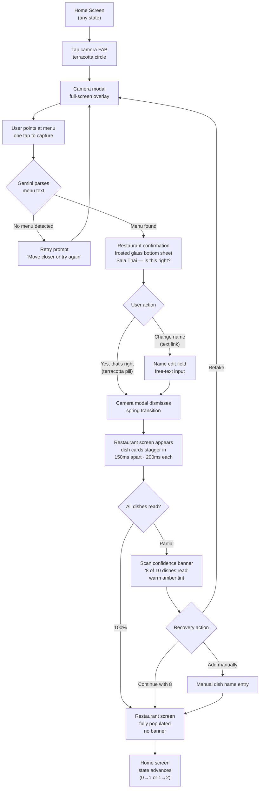
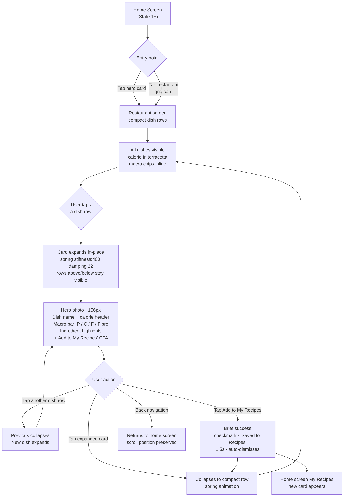
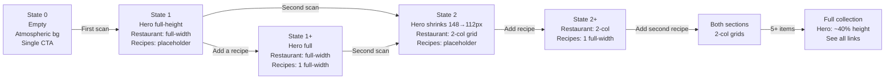
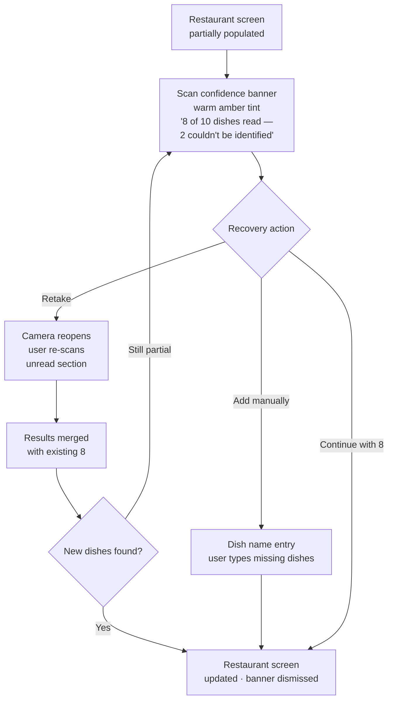

# UX Design Specification — Plately v2

**Author:** Frank
**Date:** 2026-04-11

---

## Executive Summary

### Project Vision

Plately is a mobile-first PWA (iPhone Safari primary) that owns the complete dining arc — from pre-order transparency (scan a menu, understand what you're ordering) to post-meal capture (scan a dish, take the recipe home, cook it). The emotional spine is relief → nostalgia → recreation. The primary interface is a camera. No login, no friction.

The defining model shift in v2 is capture inversion: every menu interaction is treated as implicit ownership. Unlike all mainstream food tracking tools, Plately makes removal the only intentional act — eliminating the save-or-not decision at the exact moment cognitive load is highest.

V2 is a precision rebuild, not a feature expansion. Its three explicit goals: (1) fix the reliability failures that undermine the core loop — dish photos and macro accuracy; (2) sharpen the dish-vs-recipe mental model; (3) enforce progressive disclosure so the detail that matters at the restaurant is never buried under detail that matters only at the stove.

### Target Users

Five archetypes shape the design:

- **Sofia (Curious Diner)** — scanning at the table in a social situation; the scan must feel invisible and instantaneous; expects results to resurface reliably
- **Daniel (Home Cook)** — uploading a casual photo after the fact; confidence prompts should feel conversational; the recipe screen visual identity matters emotionally
- **Marcus (Frustrated Scanner)** — dealing with real-world conditions (dim lighting, partial menus); needs one-tap retake and resilience; trust is earned by being right when the UI claims confidence
- **Priya (Repeat Visitor)** — returns to favourite restaurants; expects passive recognition; grocery list attribution by recipe matters; location awareness is a sensitivity
- **Frank (Nostalgic User)** — first session, no scan occasion; manual search must be the hero affordance on empty state; graceful fallbacks for unknown restaurants

### Key Design Challenges

1. **The scan moment** — camera UX at a social table must feel effortless and invisible; latency and visual clutter are fatal to the use case
2. **Progressive disclosure enforcement** — three strict tiers (card: macros + photo / expanded: ingredient list / intent: cooking instructions) must never bleed into each other
3. **Photo state triality** — confirmed photo, warm placeholder, and suppressed card must be visually legible at a glance without alarming users in the missing-photo case
4. **Dual-collection mental model** — Restaurants (auto-populated) vs. Recipes (user-intentional, via "Make it at home") is a new interaction model that must be learned intuitively, not through documentation
5. **Empty state as onboarding** — the first session has no scan occasion; manual search must carry the emotional weight of the entire product value proposition

### Design Opportunities

1. **Camera as primary identity** — the camera button is the product; it deserves to be the visual and interaction centre of the app shell
2. **Confirmation banner as trust moment** — the restaurant name confirmation ("Sala Thai — is this right?") is the first trust-building beat; designed well, it earns credibility for everything downstream
3. **Macro legibility at speed** — dish cards are read in dim restaurant lighting, in motion, with social distraction; the macro layout must work at a glance
4. **Graceful failure as a trust builder** — "7 of 10 dishes read" done with honesty and warmth builds more trust than silent failure or an empty screen

---

## Core User Experience

### Defining Experience

The core action is the scan (or search) — pointing a camera at a menu, or searching a restaurant name at home, and receiving an instantly-populated dish collection with macros and photos. No explicit save is required. The interaction *is* the capture.

The product's value is delivered in a single loop: open → scan/search → populated collection. Everything else (dish detail, cooking instructions, grocery list) is downstream of this moment. If this loop is not fast, reliable, and frictionless, the product does not work.

### Platform Strategy

- **Primary platform:** iPhone Safari PWA — installable, runs from home screen, no App Store
- **Viewport:** 390px (iPhone 14 base), single-column layout throughout, no desktop breakpoints required
- **Interaction model:** Touch-first. Camera is the primary input surface. All interactive elements minimum 44×44px touch target
- **Offline:** Full collection readable offline via TanStack Query cache; write operations require connectivity
- **Platform capabilities leveraged:** MediaDevices camera API (menu scan), Web App Manifest + service worker (PWA install), safe area insets for bottom nav and camera UI
- **Android / desktop:** Not in MVP scope; incidental support only

### Effortless Interactions

These must require zero thought from the user:

1. **Camera access** — from the home screen, one tap opens the camera; no confirmation dialogs, no permission flow friction beyond the system prompt
2. **Scan-to-result pipeline** — camera points at menu, processing begins immediately; user takes no further action until the restaurant confirmation banner appears
3. **Macro reading** — calories, protein, carbs, fat visible on the dish card without any tap or scroll; readable in dim lighting at a glance
4. **Restaurant confirmation** — a single tap ("Yes, that's right") closes the only mandatory decision in the entire scan flow
5. **Collection auto-population** — all recognised dishes are in the collection immediately; no per-dish selection, no bulk save, no "add all" button

### Critical Success Moments

| Moment | Why It's Make-or-Break |
|---|---|
| Scan → populated restaurant in <10s | This is the product's entire argument; a slow or empty result destroys trust on first use |
| Restaurant name confirmation banner | First trust-building interaction; if the name is wrong and the UI handles it gracefully, trust is established; if the UI hides the error, trust is lost |
| Macro legibility on the dish card | The data must change what the user orders; if it's unreadable at speed, in low light, the core value is unrealised |
| "Make it at home" intent gate | The moment the gap between "I loved this dish" and "I can have it again" closes; it must feel like a payoff, not a menu option |
| First-session empty state | Users arriving without a scan occasion must find the search affordance immediately; if the empty state is confusing, first-session drop-off is immediate |

### Experience Principles

1. **Scanning is owning** — the act of looking at a menu is the act of capturing it; no save gesture should ever be required
2. **Contextual layering** — the right information at the right moment: macros at the restaurant table, ingredient list at the dish detail view, cooking instructions only when the user declares intent to cook
3. **Trust through honesty** — when something goes wrong (partial recognition, missing photo), say so clearly and offer a path forward; silence and blank states destroy trust faster than an honest partial result
4. **Camera is the identity** — the camera is the product's defining surface; it must be the visual and interaction centre of the app shell, not a feature accessed through a menu
5. **Removal is curation** — users manage their collection by removing unwanted items, not by curating what they add; the default assumption is that everything captured is worth keeping

---

## Desired Emotional Response

### Primary Emotional Goals

Plately's emotional spine is a three-act arc:

1. **Relief** — the scan resolves uncertainty before the user commits to an order; they understand what they're eating without drawing attention to themselves at the table
2. **Nostalgia** — the collection is a record of meals that mattered; browsing it should feel warm, not utilitarian
3. **Payoff** — the "Make it at home" moment closes the gap between "I loved that dish" and "I can have it again"; this is the product's emotional climax

### Emotional Journey Mapping

| Stage | Desired Emotion | What Destroys It |
|---|---|---|
| First open / empty state | Curiosity — "let me see what this does" | Confusing empty state with no clear action |
| First scan | Focus → anticipation | Sluggish feedback; no indication it's working |
| Restaurant confirmation | Trust beginning — "it got the right place" | Wrong name with no graceful correction path |
| Collection populated | Delight — "it appeared; I didn't have to do anything" | Slow population; missing photos; broken cards |
| Browsing at home | Warmth, nostalgia | Clinical UI; heavy information density |
| "Make it at home" | Ownership, accomplishment | Feeling like a menu option rather than a moment |
| Partial recognition / error | Supported, not abandoned | Silent failure; generic or alarming error message |
| Returning to a saved restaurant | Familiarity, ease | Having to re-scan; empty collection |

### Micro-Emotions

- **Confidence, not confusion** — the dish card must answer "what am I eating?" instantly, without any tap or scroll, in dim restaurant lighting
- **Trust, not scepticism** — every macro value is a trust vote; USDA provenance indicators and the "~estimated" label manage expectations with honesty rather than silence
- **Calm, not anxiety** — the scan happens at a social table; the camera UX must feel invisible and unhurried; a progress indicator that looks like work-in-progress is better than one that looks like it might fail
- **Delight, not just satisfaction** — auto-capture is a product magic trick; the moment a restaurant populates without a save gesture is worth designing as a beat, not just a technical outcome

### Design Implications

| Emotion | UX Design Approach |
|---|---|
| Relief | Fast scan feedback loop (<10s); restaurant confirmation as a positive signal, not a warning; macros visible immediately at card level without interaction |
| Nostalgia | Warm visual palette (greige, cream); dish photos as primary visual treatment; collection browsing feels like flipping through a food memory |
| Payoff | "Make it at home" is a prominent, named CTA — not a settings option; the transition to cooking instructions feels like unlocking something |
| Delight | Auto-population is instant and silent — no "saving..." spinner; the dish cards appear, they were always going to be there |
| Trust | Honest partial recognition ("7 of 10 dishes read"); clear provenance labelling on macros; graceful placeholder for missing photos, never a broken image |
| Calm | Minimal camera UI — no overlays, no excessive controls; progress indicator is ambient, not alarming |

### Emotional Design Principles

1. **Make the magic visible** — the auto-capture moment is a differentiator; design it so users notice the absence of a save step, not just the presence of results
2. **Earn trust early, spend it later** — the first interaction (restaurant confirmation) sets the trust baseline for everything downstream; it must be right or recoverable
3. **Warmth over efficiency** — the collection is a personal food memory, not a database; visual warmth (palette, typography, photos) must reflect this even at small scale
4. **Fail with grace, not silence** — partial results, missing photos, and API failures are expected; the emotional goal is "supported and informed," never "abandoned and confused"
5. **The stove is a different room** — cooking instructions must feel like entering a new context, not just scrolling down; the intent gate is an emotional transition, not a UI toggle

---

## UX Pattern Analysis & Inspiration

### Inspiring Products Analysis

**Google Lens** — the clearest reference for the scan interaction model, and the sharpest competitive reference point.

*What it does exceptionally well:* Point camera → instant identification → zero decisions during capture. No account, no onboarding friction. The result appears overlaid on the thing being scanned — the feedback loop is immediate and magical. Works on any surface including handwritten menus.

*Why Plately diverges after the capture:* Lens is a lookup tool — every scan is an ephemeral search query that disappears. It identifies but never retains. There is no collection, no memory, no accumulation of meaning. Lens treats a menu scan as "tell me what this is." Plately treats it as "this is now mine." The answer to "why not just use Google Lens?" is: Lens ends the moment you know the dish name. Plately starts there.

*UX lesson:* Borrow the capture front-end (instant, frictionless, point-and-go, no decisions during scanning) but diverge completely on what happens after the scan.

---

**Letterboxd** — the clearest reference for the collection model and the emotional relationship with a personal record.

*What it does well:* A personal record of films you've seen that accumulates meaning over time. Browsing your Letterboxd diary feels nostalgic, not administrative. The collection *is* the emotional object — you're not managing a database, you're tending a food memory. The card-based browsing with poster art as primary visual treatment maps closely to dish cards with photos.

*UX lesson:* The restaurant collection should feel like Letterboxd for restaurants — a warm, visually-driven record of places you've been and meals you've loved. Browsing it at home should produce nostalgia, not task completion.

---

**Deliveroo / Just Eat** — reference for dish card layout and progressive detail reveal.

*What it does well:* Dish cards with photo + price + brief description at card level; tap to expand for full description and options. The visual hierarchy puts the photo as hero and the essential decision data (what it is, what it costs) immediately visible.

*UX lesson:* Dish card layout validation — photo dominant, macros immediately visible, no tap required for the core decision data. Plately's card removes the ordering layer but retains the visual hierarchy.

---

**MyFitnessPal (anti-pattern reference)** — the explicit log/save model is exactly what Plately inverts.

*The anti-pattern:* Every food item requires an explicit save action. The user must decide to log, search for the item, confirm the entry, and track the save. The cognitive overhead is highest exactly when engagement is lowest (social meal, unfamiliar restaurant). The save gesture is a barrier.

*UX lesson:* The absence of a save step in Plately is a feature, not an omission. Design choices must make this absence *visible* — users should notice they didn't have to save.

---

**Yelp / TripAdvisor (anti-pattern reference)** — restaurant-first navigation that buries dishes.

*The anti-pattern:* Restaurant page → reviews tab → menu tab → category → dishes. Dishes are a sub-item of a restaurant, which is a sub-item of a category. Four levels of navigation to reach a dish. Information density at every level is high.

*UX lesson:* In Plately, dishes are first-class objects. A restaurant is a container for dishes, not the hero. Navigation should reach dishes in two taps from the home screen: restaurant → dish card.

### Transferable UX Patterns

**Navigation Patterns:**
- **Tab bar with camera as centre action** (Letterboxd, Instagram, camera apps) — the camera is the identity; it should be the primary affordance in the navigation, not buried in a menu
- **Dish-first within restaurant** (Deliveroo card model) — once inside a restaurant, the dish grid/list is the entire content; no reviews, no info tabs at the same level

**Interaction Patterns:**
- **Scan-first, decide-never** (Google Lens capture model) — no decisions during the capture phase; the only decision is the restaurant confirmation after the scan completes
- **Capture-then-curate** (Apple Notes / Voice Memos philosophy) — the act of capture is unconditional; curation (removal) is a separate, later act
- **Progressive reveal on tap** (Deliveroo dish detail) — card shows the minimum necessary; tap reveals the next layer; a second intent gate (Make it at home) reveals the third

**Visual Patterns:**
- **Photo as primary card element** (Letterboxd, Deliveroo) — the photo carries emotional weight; text is secondary and structured
- **Warm, editorial palette** (Letterboxd's cream/bone tones) — a personal collection feels different from a utility app; warmth signals "this is yours"
- **Ambient progress indicators** — progress during scan should feel like anticipation, not loading; ambient animation rather than a progress bar

### Anti-Patterns to Avoid

1. **Explicit save gestures on capture** (MyFitnessPal model) — conflicts with the capture inversion model; any "save" or "add" button at the point of scan is a regression to v1 thinking
2. **Restaurant-deep navigation** (Yelp / TripAdvisor) — burying dishes under restaurant info tabs adds friction at the exact moment users need to move fast
3. **Information wall after scan** (Google Lens / Google Search results) — returning a dense results page after scanning destroys the "it just worked" feeling; results must be structured and scannable
4. **Silent failures** — Lens doesn't tell you when it's struggling to identify something; Plately must be explicit about partial confidence to build trust
5. **Generic error states** — "Something went wrong" with no context or recovery path; every failure mode in Plately has a specific, actionable response

### Design Inspiration Strategy

**What to adopt directly:**
- Google Lens capture UX: instant, frictionless, point-and-go, zero decisions during scanning
- Letterboxd collection model: personal, warm, nostalgic, photo-led browsing
- Deliveroo dish card hierarchy: photo dominant, essential data immediately visible

**What to adapt:**
- Deliveroo's "tap for detail" pattern → adapted with Plately's three-tier progressive disclosure and the "Make it at home" intent gate as a deliberate third tier
- Letterboxd's card browsing → adapted for dish-first layout within a restaurant container, with macro data replacing star ratings as the primary secondary information

**What to avoid:**
- Google Lens's ephemeral, lookup-only model after capture
- MyFitnessPal's explicit log/save friction model
- Yelp's restaurant-as-hero, dishes-buried navigation hierarchy

---

## Design System Foundation

### Design System Choice

**Tailwind CSS v4 + CSS custom property glass token system + Framer Motion**

No component library. All components are custom-built on Tailwind utilities, with glass surface behaviour defined in a bespoke CSS token layer. Framer Motion handles spring-physics animation.

### Rationale for Selection

1. **Tailwind v4 is already the stack** — not a new decision; carries forward from v1
2. **CSS backdrop-filter on Safari iOS is fully capable** — `backdrop-filter: blur() saturate() brightness()` achieves ~85% of UIKit glass fidelity; the perceptual gap is subtle and requires side-by-side native comparison to detect
3. **The Glass UI gap is an implementation gap, not a Tailwind limitation** — the current app's flat dark surfaces are a missing CSS token system, not a framework constraint
4. **True UIKit vibrancy would require React Native** — a complete tech stack swap (no PWA, App Store distribution required); not warranted for the fidelity delta
5. **SF Pro font is achievable via `-apple-system`** — Safari iOS renders the actual system font; no font licensing needed

### Glass Token System (Core Design System Layer)

These CSS custom properties are the design system's glass foundation. Every surface in the app must use one of these tokens — no solid backgrounds on interactive surfaces.

```css
/* Glass surface tokens */
--glass-base:        rgba(255, 252, 247, 0.82);   /* cards, panels */
--glass-elevated:    rgba(255, 253, 249, 0.94);   /* nav pill, modals */
--glass-overlay:     rgba(255, 252, 247, 0.72);   /* inline banners */
--glass-sunken:      rgba(240, 238, 232, 0.78);   /* input backgrounds */

/* Glass blur tokens */
--blur-base:         blur(24px) saturate(1.4) brightness(1.02);
--blur-elevated:     blur(32px) saturate(1.5) brightness(1.03);
--blur-heavy:        blur(48px) saturate(1.6);    /* atmospheric bg */

/* Glass border tokens */
--border-glass:      1px solid rgba(180, 170, 158, 0.22);
--border-glass-strong: 1px solid rgba(180, 170, 158, 0.32);

/* Glass shadow tokens */
--shadow-float:      0 8px 32px rgba(80,60,40,0.12), 0 2px 8px rgba(80,60,40,0.08);
--shadow-card:       0 2px 12px rgba(80,60,40,0.08), 0 1px 3px rgba(80,60,40,0.06);
```

### Atmospheric Background Rule

Every screen must have a blurred food photo as its base layer:

```css
/* Atmospheric background — always present, always bleeding through glass surfaces */
background-image: url(food-photo);
filter: blur(40px) saturate(1.3);
transform: scale(1.05); /* prevents blur edge artifacts */
/* + warm cream gradient overlay */
```

This is the condition that makes glass surfaces work. Without a rich background behind them, frosted glass surfaces look like plain white panels.

### Implementation Approach

- **Tailwind v4 utilities** — layout, spacing, flex/grid, color scale
- **CSS custom properties** — all glass tokens; referenced via Tailwind arbitrary values: `bg-[var(--glass-base)]`, `backdrop-blur-[var(--blur-base)]`
- **Framer Motion** — spring physics for all interactive transitions: `stiffness: 400, damping: 22`
- **No component library** — all components are bespoke; component library entries in this spec are the blueprint

### What the Current App Must Fix

The current implementation has the atmospheric background but is not applying glass surfaces consistently:

1. Nav bar must become a floating frosted glass pill — not a flat full-width bar
2. Cards must use `--glass-base` + `--blur-base` — not solid dark backgrounds
3. Headers and banners must be frosted — no opaque surfaces
4. All interactive surfaces must let the atmospheric background bleed through

---

## Defining Core Experience

### The Defining Interaction

> "Point at a menu. Walk away with every dish."

Plately's core interaction is menu scan → instant auto-captured collection. It is not a search query. It is not a save gesture. The act of scanning *is* the act of ownership. Users curate by removing — but the default is that everything captured belongs to them.

If this single interaction is executed flawlessly — fast, reliable, requiring zero decisions during capture — everything else in the product follows from it. If it fails or requires effort, no other feature compensates.

### User Mental Model

**The mental model users arrive with:** "I'll point at this, it'll show me some results, and I'll decide what to save" — a Google Lens / MyFitnessPal hybrid. Users expect a search-then-save pattern because that's every analogous tool they've used.

**The mental model Plately must install:** "I pointed at the menu. It's mine." The shift is from agent (I decide what to save) to curator (I decide what to remove). This is unfamiliar. Users must discover it by experiencing it — not through onboarding copy.

**The "aha" moment:** Realising they never had to tap save. The first time a user finishes a scan and sees a fully populated restaurant collection without having made a single selection decision, the mental model shifts.

**Design implication:** Never show a "save" button anywhere in the scan or search flow. The absence of the save gesture is the teaching mechanism.

### Success Criteria for the Core Experience

| Criterion | Signal |
|---|---|
| Speed | Scan → populated restaurant in <10 seconds on LTE |
| Zero friction | No user decision required between camera open and restaurant populated (except one: restaurant name confirm) |
| Trust earned | User verifies the restaurant name is correct without feeling corrected |
| Delight visible | Dishes appear without a save gesture — user registers the absence |
| Resilience | Partial recognition handled honestly; user never lands on a broken or empty screen |

### Novel vs. Established Patterns

**Established (borrow directly):**
- Camera scan UI — full-screen overlay, scan frame, capture button. Users know this from Google Lens, QR scanners, document cameras. No education needed.
- Confirmation banner — "Is this right?" pattern. Users know this from Maps, autocomplete, address confirmation. Natural.
- Expandable cards — tap to reveal more. Users know this from every content app. Natural.

**Novel (requires design care):**
- **Auto-capture with no save gesture** — users will look for a save button. The UX must make the auto-capture outcome unmistakably visible. The dish collection populating without interaction is the moment. It must be animated and salient, not silent.
- **Three-tier progressive disclosure** — card / expanded / intent-gated is not a common pattern. The "Make it at home" intent gate in particular is a new concept. It must be presented as an invitation, not a setting.
- **Removal as curation** — the swipe-to-remove / long-press-to-delete pattern is established, but using it as the *primary* management action (not just an edge case) is novel in food tracking.

**Teaching strategy for novel patterns:** Show, don't tell. Empty state copy on the home screen can hint: *"Your scan is your collection — no saving needed."* The first scan does the rest.

### Experience Mechanics — The Scan Flow

**1. Initiation**
- Entry: camera FAB (terracotta circle, floating pill nav bar right end)
- Transition: spring scale-up `stiffness:400 damping:22`; full-screen camera overlay replaces screen
- Scan frame brackets animate in over the live viewfinder

**2. Interaction**
- User points at menu; Gemini parsing begins immediately on capture (no explicit "scan" button — tap once to capture, parsing starts)
- Feedback during parse: ambient pulse on scan frame corners — feels like anticipation, not loading
- No copy that says "processing" or "please wait"

**3. Feedback — Restaurant Confirmation**
- Frosted glass bottom sheet slides up: *"[Restaurant Name] — is this right?"*
- Two actions: **"Yes, that's right"** (primary, terracotta) / **"Change name"** (secondary, text link)
- Tone: conversational and warm, not transactional

**4. Completion**
- Camera overlay dismisses with spring transition
- Restaurant screen appears; dish cards stagger-animate in (150ms between each, 200ms duration)
- No "saved!" toast, no confirmation copy — the populated collection is the feedback
- Scan confidence banner appears if < 100% recognition: *"8 of 10 dishes read — 2 couldn't be identified"* with context-aware retry options

---

## Visual Design Foundation

### Color System

**Background & Surface Scale:**

| Token | Value | Usage |
|---|---|---|
| `--color-bg-base` | `#FAFAF7` | Primary app background (never cold white) |
| `--color-bg-elevated` | `#EFEDE6` | Elevated surfaces, grouped sections |
| `--color-bg-sunken` | `#E8E6DF` | Recessed inputs, inactive states |
| `--color-card` | `rgba(255,252,247,0.88)` | Frosted cream card base |

**Text Scale:**

| Token | Value | Usage |
|---|---|---|
| `--color-text-primary` | `#1A1612` | Warm near-black; all primary text |
| `--color-text-secondary` | `#6B6458` | Labels, metadata |
| `--color-text-tertiary` | `#9E9589` | Captions, inactive nav |
| `--color-text-disabled` | `#C4BDB5` | Disabled states |

**Accent:**

| Token | Value | Usage |
|---|---|---|
| `--color-accent` | `#C4622D` | Terracotta; camera FAB, primary CTAs, active nav |
| `--color-accent-tint` | `#FAEEE6` | Tinted backgrounds behind accent elements |
| `--color-accent-dark` | `#9E4B1F` | Pressed/active accent state |

**Status Tints:**

| State | Value |
|---|---|
| Error | `rgba(251,234,234,0.95)` |
| Success | `rgba(232,245,238,0.95)` |
| Warning | `rgba(251,243,226,0.95)` |

**Borders:** `rgba(180,170,158,0.22–0.28)` — warm-toned, very subtle

**Atmospheric gradient overlay:**
```css
linear-gradient(180deg,
  rgba(250,250,247,0.55) 0%,
  rgba(244,243,238,0.72) 60%,
  rgba(239,237,230,0.88) 100%
)
```

### Typography System

| Level | Size | Weight | Usage |
|---|---|---|---|
| Display | `32px` | 700 | Restaurant hero name (Playfair Display) |
| H2 | `24px` | 600 | Section titles (DM Sans) |
| H3 | `20px` | 600 | Card titles, dish names |
| H4 | `17px` | 600 | Sub-section headers |
| Body | `15px` | 400 | All body text; `line-height: 1.6` |
| Label | `13px` | 500 | Metadata, secondary labels |
| Caption | `11px` | 400–500 | Timestamps, provenance labels |
| Tab | `10px` | 500 | Nav tab labels; wide tracking |

**Font families:** Playfair Display (display/hero only) + DM Sans (all UI). On iOS Safari, `-apple-system` resolves to SF Pro natively.

### Spacing & Layout Foundation

**Base unit:** `4px`

| Token | Value | Primary usage |
|---|---|---|
| `--space-1` | `4px` | Icon-to-label gap |
| `--space-2` | `8px` | Chip internal padding |
| `--space-3` | `12px` | Between related elements |
| `--space-4` | `16px` | Screen horizontal gutters |
| `--space-5` | `20px` | Card internal padding |
| `--space-6` | `24px` | Section gaps |
| `--space-8` | `32px` | Major section separators |

- **Viewport:** 390px (iPhone 14); single-column throughout; no desktop breakpoints
- **Philosophy:** Airy (TIDE reference) — generous vertical breathing room, never cramped
- **Collections:** 2-column grid, `gap-3`; horizontal scroll rows with `px-4` container
- **Safe areas:** `env(safe-area-inset-bottom/top)` respected on nav bar and camera UI

### Accessibility Considerations

- WCAG 2.1 AA target throughout; `#1A1612` on `#FAFAF7` achieves ~14:1 contrast
- Glass surfaces enforce minimum overlay opacity via `--glass-*` token floor values
- All interactive elements minimum `44×44px` touch target
- Framer Motion `useReducedMotion()` gates all spring animations
- `aria-live="polite"` on scan confidence banner, enrichment progress, and error states — text content mutation only (not `aria-label` mutation)

---

> **Scope note:** The remaining design direction work is focused on two screens — the **restaurant screen** (dish presentation) and the **home screen** (style/layout). The app's broader structure (navigation, camera flow, settings) is architecturally sound and receives the glass token treatment from the Design System Foundation section without redesign.

---

## Design Directions — Confirmed

*Reference: `planning/ux-design-directions.html` — 5 phone mockups*

### Restaurant Screen: Compact Row + In-Place Expansion

**Chosen pattern:** Direction B (Compact Row) as the default, with a tap-to-expand interaction that reveals Direction A (Hero Stack) in-place.

**Default state — compact rows:**
- Each dish is a compact frosted glass card: `72×72px` thumbnail left, dish name + 2-line tags right, calorie count in terracotta (`#C4622D`), macro chips (P/C/F) inline
- `~6–7 dishes visible` before any scrolling — suits the "scanning a menu" mental model
- All dishes are shown without any interaction; no "load more" or pagination

**Expanded state — in-place hero:**
- Tap any dish row → card expands vertically in-place, pushing rows below down; rows above stay visible
- Expanded card reveals: full-width hero photo (`156px`), dish name + calorie at header level, 4-cell macro bar (Protein / Carbs / Fat / Fibre), ingredient highlights list, "Add to My Recipes" CTA pill
- Tap expanded card again → collapses back to compact row
- Animation: spring `stiffness:400 damping:22`; smooth accordion expand/collapse

**Calorie prominence:** The calorie figure is always terracotta (`#C4622D`) and 14px semibold at compact size — it reads at a glance without expansion.

**Filter pills:** Horizontal scroll row of category pills (All / Noodles / Curries / Soups / Desserts etc.) above the dish list. Active pill uses terracotta fill.

**NOT:**
- NOT a full-screen dish detail page on tap — expansion is in-place within the list
- NOT a horizontal pill scroll for navigating between dishes at the top of the screen
- NOT a bottom "Other dishes on this menu" section (redundant with the visible list)

---

### Home Screen: Progressive States Architecture

**Chosen pattern:** Two independent sections (Restaurants + My Recipes), each scaling from empty to full independently. Hero is always the most recent restaurant visit.

**Data model distinction:**
- **Restaurants** — auto-captured from every scan or search; every visit creates a restaurant entry with all dishes
- **My Recipes** — user-intentional saves; dishes the user explicitly adds via "Add to My Recipes" in the expanded dish card

#### State 0 — Empty (no scans)

- Atmospheric gradient background, no card grid
- Centered: large icon, Playfair Display tagline ("Take home the food you love"), brief supporting copy, single terracotta pill CTA ("📷 Scan a menu")
- No empty placeholder cards; no section headers until content exists

#### State 1 — First scan (1 restaurant, 0 recipes)

- **Hero card at full prominence:** restaurant photo strip (`148px`), restaurant name + cuisine + visit time overlaid, horizontal dish thumbnail row (all captured dishes as `52×52px` mini cards), "View all" link, dish count label
- **Restaurants section:** full-width compact card (not grid — 1 item fills width)
- **Recipes section:** quiet empty placeholder ("Expand any dish and tap Add to My Recipes") — dashed border, muted text, no CTA

#### State 2 — Growing (2 restaurants, 2 recipes)

- **Hero card:** slightly shorter photo strip (`112px`) — content below has earned more space; still always most recent visit
- **Restaurants section:** 2-column glass grid; each card shows photo + name + dish count
- **Recipes section:** 2-column glass grid; each card shows photo + name + calorie figure in terracotta

#### State 3+ — Full collection (3+ of each)

- Hero stays at ~40% of viewport height
- Both sections continue expanding as 2-column grids; overflow scrolls within the section or links to a dedicated screen
- "See all (N)" link appears on each section header once it exceeds 4 items

**Scale rule:** 1 item → full-width. 2 items → side by side. 3–4 items → 2-column grid (2 rows). 5+ → "See all" overflow link.

---

### Dish Detail Page: Simplified Navigation

**Confirmed change:** Remove "Other dishes on this menu" bottom section — it duplicates the dish pill scroll already at the top. The two navigation systems for the same content create cognitive overhead.

**Pill scroll — retained and enhanced:**
- Pills show truncated dish names (2–3 word max): "Pad See Ew", "Green Curry", "Mango Stic…"
- Active dish pill: terracotta fill, white text
- Inactive dish pills: ghost/outline, `--color-text-tertiary`
- Left-overflow hint (partial pill visible at left edge) signals horizontal scrollability
- Swipe left/right on main dish content area also navigates between dishes (pills update to match)

**Back navigation:** Contextual "← Sala Thai" text link in the top-left — returns user to the restaurant screen with the full dish list visible.

---

## User Journey Flows

*Scope: flows for the restaurant screen (dish presentation) and home screen (progressive layout). PRD journeys provide the narrative foundation; these flows specify the interaction mechanics.*

### Flow 1 — Menu Scan → Restaurant Populated _(primary capture loop)_

**Trigger:** User at a restaurant, unfamiliar menu in front of them. Collection is in any state.
**Key constraint:** Zero decisions between camera open and restaurant populated. The restaurant name confirmation is the only required interaction.



**Optimisations:**
- Ambient pulse on scan frame corners during parse — feels like anticipation, not loading
- No "Saving…" toast — the populated collection is the confirmation
- Restaurant confirmation banner slides in from bottom; spring-collapses on "Yes"

---

### Flow 2 — Browse → Restaurant → Dish Expand → Add to Recipes

**Trigger:** User on home screen, tapping into a restaurant to browse dishes or compare macros.
**Key constraint:** Macros readable at compact row level without any tap. Expansion reveals depth, not basics.



**Optimisations:**
- Only one dish can be expanded at a time — tapping a second auto-collapses the first
- "Add to My Recipes" lives inside the expanded card — keeps the intent gate clear
- Dish pill scroll at top of any full dish detail view: terracotta pill = active, ghost = others; swipe on content also navigates

---

### Flow 3 — Home Screen State Progression

**Trigger:** Collection building over multiple sessions.
**Key constraint:** Every state feels intentional and complete — never like a half-empty grid.



**Scale rule (both sections, same logic):**

| Items | Layout |
|---|---|
| 0 | Hidden or quiet placeholder |
| 1 | Full-width card |
| 2 | Side by side |
| 3–4 | 2-col grid |
| 5+ | 2-col grid + "See all (N)" |

**Optimisations:**
- Hero height transition (148px → 112px) is animated — `transition: height 400ms ease-out` — on second restaurant added
- Atmospheric gradient crossfades (400ms) to match most recent restaurant visit

---

### Flow 4 — Partial Recognition Recovery

**Trigger:** Gemini reads fewer than 100% of dishes. Recognised dishes populate; unrecognised are suppressed entirely (no broken cards).



**Optimisations:**
- Unrecognised dishes fully suppressed — no empty slots, no skeleton cards
- Banner tone is warm amber, not red — "let me help you" not "something failed"
- "Continue with 8" always available — user is never forced to resolve partial state

---

### Journey Patterns

**Navigation patterns:**
- **Hero-first entry** — tapping the hero card on the home screen navigates directly to the restaurant screen; no intermediate step
- **In-list expansion** — detail revealed within the list, not by navigating away; list context always preserved above and below the expanded card
- **Pill scroll as position indicator** — dish pills mirror list order; navigation affordance and "you are here" signal simultaneously

**Feedback patterns:**
- **Populated collection as confirmation** — dish cards stagger in; no toast, no "saved!" copy — the visual result is the feedback
- **Honest partial feedback** — confidence banners name the successes first ("8 of 10") before the failure ("2 couldn't be identified")
- **Brief success on save** — 1.5s checkmark on "Add to My Recipes"; auto-dismisses; the home screen recipe card is the durable confirmation

**Decision patterns:**
- **One required decision per flow** — scan: restaurant name confirm only. Browse: which dish to expand (zero commitment). Save: explicit "Add to My Recipes" tap. Recovery: one of three exit paths.
- **Reversibility everywhere** — expand collapses on tap; recipes can be removed; restaurants can be removed; partial recovery always available

---

### Flow Optimisation Principles

1. **Fewest taps to value** — populated dish list with macros is reachable in 2 taps from the home screen: hero card → restaurant screen. No intermediate navigation.
2. **Never strand the user** — every failure state offers at least one forward path (retake, manual add, continue). Dead ends are not allowed.
3. **Progressive commitment** — browsing is zero-commitment; saving is one tap; cooking instructions require a second explicit intent tap. Commitment scales with depth.
4. **Context persistence** — returning from dish detail preserves restaurant screen scroll position; returning from restaurant screen preserves home screen scroll position.
5. **Animation as communication** — stagger animation on dish population communicates "these are being added" without copy. Spring collapse communicates "reversible" without a confirmation dialog.

---

## Component Strategy

*Design system: Tailwind CSS v4 + CSS glass token system + Framer Motion. No component library — all components custom-built.*

### Design System Foundation Coverage

| Concern | Provided by | Status |
|---|---|---|
| Layout & spacing utilities | Tailwind CSS v4 | ✅ Available |
| Glass surface tokens (`--glass-*`, `--blur-*`) | CSS custom properties | ✅ Defined in spec |
| Spring animation | Framer Motion | ✅ Available |
| Atmospheric background layer | CSS (blur + scale + gradient overlay) | ✅ Defined in spec |
| Typography scale | DM Sans + Playfair Display | ✅ Available |
| Colour tokens (`--color-accent`, `--color-text-*`) | CSS custom properties | ✅ Defined in spec |
| Interactive components | — | ❌ All custom |

### Custom Components

#### GlassCard _(base primitive)_

Shared frosted glass surface wrapper underlying all cards. Not rendered directly — used as a composition primitive.

**Variants:**
- `base` — `--glass-base` + `--blur-base` + `--shadow-card` — dish rows, grid cards
- `elevated` — `--glass-elevated` + `--blur-elevated` + `--shadow-float` — expanded dish, hero card, nav pill
- `overlay` — `--glass-overlay` + `--blur-base` — banners, bottom sheets

---

#### FloatingNavBar

Two sibling children: frosted glass capsule pill (`flex:1`, `62px` height, `9999px` radius) + terracotta camera circle (`62×62px`). Fixed bottom, `16px` side padding, `20px` bottom padding. Full spec in `references/style-profile.md`.

**States:** Tab inactive (stroke icon + tertiary label) · Tab active (filled icon + terracotta label) · Camera pressed (`scale(0.88)` spring)
**Accessibility:** `role="navigation"` on pill · camera `aria-label="Scan a menu"`
**NOT:** NOT edge-to-edge. NOT embedded inside the pill. NOT a tab.

---

#### EmptyState

Full-screen zero-content state for home screen State 0.

**Anatomy:** Centered column — `52px` icon · Playfair `22px` title · `13px` body (max `210px` wide) · terracotta pill CTA (`50px` height, `9999px` radius)
**Content:** "Take home the food you love" · "Scan a restaurant menu and every dish lands in your collection — instantly."
**Accessibility:** `role="main"` · CTA `aria-label="Open camera to scan a menu"`

---

#### HeroCard

Featured last-visit restaurant card at the top of the home screen. Height varies by collection state.

**Anatomy:** Photo strip (full-width, dark gradient overlay, restaurant name + meta overlaid bottom-left) + card body (dish thumbnail row `52×52px` + footer: dish count + "View all ›")
**Variants:** State 1 = `148px` photo · State 2+ = `112px` photo · height transition `400ms ease-out`
**Glass surface:** `--glass-base` + `--blur-base` · `22px` radius · `--shadow-float`
**Accessibility:** `role="article"` · `aria-label="[Restaurant name], last visited [time]"`

---

#### DishRowCompact

Compact dish row — the default state for all dishes on the restaurant screen.

**Anatomy:** `72×72px` photo thumbnail (`11px` radius) · right column: dish name (`14px` semibold) + tags (`11px` tertiary) + macro row (calorie `14px` semibold terracotta + macro chips P/C/F) · trailing chevron (disabled colour)
**Height:** ~`90px` auto
**Glass surface:** `--glass-base` + `--blur-base` · `18px` radius · `--shadow-card`
**States:** Default · Pressed (`scale(0.98)` spring `50ms`)
**Interaction:** Tap → expands in-place via DishRowExpanded; chevron rotates `90deg`
**Accessibility:** `role="button"` · `aria-expanded` · `aria-label="[Dish name], [cal] calories"`

---

#### DishRowExpanded

In-place accordion expansion of DishRowCompact. Reveals hero photo, full macros, ingredient list, and save CTA.

**Anatomy:** Hero photo `156px` · content block: name (Playfair `19px`) + calorie (`19px` semibold terracotta) · description (`12px` secondary) · MacroBar · ingredients label + text · "Add to My Recipes" CTA pill (`42px` height, terracotta fill)
**Glass surface:** `--glass-elevated` + `--blur-elevated` · `20px` radius · elevated shadow
**States:** Expanding (spring `stiffness:400 damping:22`, `height: 0 → auto`) · Expanded · Collapsing
**Interaction:** Tap anywhere → collapse. Tap CTA → save + collapse.
**Accessibility:** `role="region"` · `aria-label="[Dish name] details"` · CTA `aria-label="Add [Dish name] to My Recipes"`

---

#### MacroBar

Four equal-width cells displaying Protein / Carbs / Fat / Fibre. Used inside DishRowExpanded.

**Anatomy:** 4 flex cells · each: uppercase label `9px` semibold tertiary + value `14px` semibold primary · inter-cell dividers `rgba(180,170,158,0.14)`
**Surface:** `rgba(244,242,238,0.5)` fill · `11px` radius · `--border-glass`
**States:** Display only — no interactivity

---

#### FilterPillRow

Horizontal scrollable category filter above the dish list on the restaurant screen.

**Anatomy:** `overflow-x: auto` scroll container · `gap: 7px` · N × FilterPill children
**FilterPill:** `30px` height · `9999px` radius · `px-12` · `12px` medium
- Active: terracotta fill + white text
- Inactive: `--glass-base` + `--color-text-secondary` + `--border-glass`
**Accessibility:** `role="group"` · `aria-label="Filter by category"` · each pill `role="radio"` with `aria-checked`

---

#### ScanConfidenceBanner

Partial scan recognition feedback with recovery actions.

**Anatomy:** Amber tinted surface (`rgba(251,243,226,0.95)`) · count text ("8 of 10 dishes read") · secondary text ("2 couldn't be identified") · 3 actions: Retake / Add manually / Continue with 8
**Position:** Slides up from bottom of restaurant screen content, above nav bar
**States:** Visible (slides in, spring `stiffness:380 damping:24`) · Dismissed (slides out)
**Accessibility:** `role="alert"` · `aria-live="assertive"`

---

#### RestaurantHeader

Restaurant identity and back-navigation anchor at the top of the restaurant screen.

**Anatomy:** Back link ("‹ Restaurants" `13px` terracotta) · name (Playfair `24px`) · meta row (cuisine · location · rating `13px` secondary, dot separators)
**Position:** Scrolls with content (not sticky)
**Accessibility:** Back link `role="link"` · `aria-label="Back to Restaurants"`

---

#### HomeSection

Section container with title and optional overflow link.

**Anatomy:** Header row (title `16px` semibold · optional "See all (N)" `12px` terracotta) + content slot
**Behaviour:** "See all" link appears only when items > 4
**Accessibility:** `role="region"` · `aria-label="[Section title]"`

---

#### RestaurantGridCard / RecipeGridCard

Two-column grid cards for the home screen collection sections.

**Anatomy:** Photo area `68px` · card body: name (`12px` semibold) + meta (`11px` — dish count for restaurant · calorie in terracotta for recipe)
**Glass surface:** `--glass-base` + lighter blur · `16px` radius · `--shadow-card`
**States:** Pressed (`scale(0.97)` spring)

---

#### SectionEmptyPlaceholder

Quiet placeholder within the My Recipes section before any recipes are saved.

**Anatomy:** Dashed border `1.5px dashed rgba(180,170,158,0.35)` · `18px` radius · centered muted text (`12px` disabled colour) · no fill, no shadow, no CTA

---

### Component Implementation Roadmap

**Phase 1 — Critical path** *(core capture loop + restaurant screen)*

| Component | Needed for |
|---|---|
| GlassCard | Every surface in the app |
| FloatingNavBar | All screens — update existing to glass spec |
| DishRowCompact | Restaurant screen default state |
| DishRowExpanded | Restaurant screen tap-to-expand |
| MacroBar | Inside DishRowExpanded |
| ScanConfidenceBanner | Partial recognition recovery |
| EmptyState | Home screen State 0 |
| HeroCard | Home screen State 1 |

**Phase 2 — Collection growth** *(home screen States 2+)*

| Component | Needed for |
|---|---|
| RestaurantGridCard | Home screen Restaurants 2-col grid |
| RecipeGridCard | Home screen My Recipes 2-col grid |
| HomeSection | Section headers with "See all" |
| SectionEmptyPlaceholder | My Recipes placeholder |
| FilterPillRow | Restaurant screen category filter |
| RestaurantHeader | Restaurant screen header |

**Phase 3 — Refinement** *(dish navigation + polish)*

| Component | Needed for |
|---|---|
| DishPillScroll | Dish detail page navigation |
| HeroCard height transition | Animation when State 1 → 2 |
| Atmospheric background crossfade | Updates on new restaurant visit |

---

## UX Consistency Patterns

*Scope: button hierarchy, feedback, navigation, empty states, loading states, and gesture patterns for the restaurant screen and home screen. Grounded in the component strategy (step 11) and user journey flows (step 10).*

---

### Button Hierarchy

Four tiers. Never mix tiers on the same surface.

| Tier | Appearance | Use case | Example |
|---|---|---|---|
| **Primary CTA** | Full-width terracotta pill (`#C4622D`), `52–56px` height, `border-radius: 9999px`, white DM Sans 600 | One per screen — the single most important action | "Add to Recipes", "Start Cooking" |
| **Secondary action** | Ghost pill — transparent fill, `1px solid rgba(196,98,45,0.4)`, terracotta text | Supporting or optional path alongside primary | "View Full Menu", "Edit Dish" |
| **Destructive** | Dusty rose tint `rgba(251,234,234,0.95)`, warm rose text `#B94040`, below Save in edit form | Removal or irreversible actions — always edit-gated | "Delete Recipe" |
| **Inline text action** | No background, terracotta text, `font-weight: 500` | Low-priority contextual actions within cards or lists | "See all", "Change restaurant" |

**NOT:**
- Never a full-width destructive pill — destructive always appears as an edit-gated button at the bottom of an edit form
- No floating action buttons other than the camera circle in the nav bar
- No icon-only buttons except the nav bar camera circle and top-row overlays (close, upload)
- No delete actions on the Home screen — it is a springboard only

---

### Feedback Patterns

**Auto-capture confirmation (transient toast)**
- Fires when a scan creates a restaurant + dishes in the collection
- Duration: 2.5s, auto-dismiss — no user action required
- Position: top of screen, 12px below status bar, `mx-4`
- Appearance: frosted glass card (`--glass-elevated`), `border-radius: 16px`, 1px warm border, warm shadow
- Content: restaurant name bold + dish count — "Sala Thai · 6 dishes saved"
- Animation: slides down from top (`translateY(-120%) → 0`), `250ms ease-out`; slides back up on dismiss
- **NOT** a blocking modal — never interrupts flow

**Scan recognition failure (inline error)**
- Appears in the camera modal frame area after a failed attempt
- Replace scan frame with dusty rose tinted panel + warm icon
- Copy: "Couldn't read the menu clearly" + three recovery actions as ghost pills: "Try again", "Upload photo", "Enter manually"
- **NOT** a toast — the user needs to act, so the error stays visible

**USDA macro resolution (progressive reveal)**
- While nutrition is loading: macro values show `—` in muted colour `#C4BDB5`
- On resolution: values animate in with `200ms opacity` fade + subtle `translateY(4px → 0)` per cell, staggered 50ms
- **NOT** a skeleton loader on the whole card — only the numeric values are deferred

**Grocery merge summary (inline card)**
- Appears at the top of the Grocery screen after adding recipes
- Frosted glass card with warm amber tint `rgba(251,243,226,0.95)`, collapsible
- Shows: items merged (quantity combined) vs. items added fresh vs. items skipped (duplicate unit mismatch)
- Dismisses via "Got it" inline text action
- **NOT** a toast — the merge summary is informational and may contain multiple lines

**Recipe deletion (edit-gated)**
```
Recipe detail → "Edit" (header button)
→ edit form opens
→ "Delete Recipe" — destructive text at bottom of form, below Save
   rose text #B94040, lower visual weight than Save
→ Tap → confirmation bottom sheet:
   "Remove this recipe from your collection?"
   Ghost pill "Remove" + inline cancel text "Keep it"
→ Confirm → recipe removed, navigate back to Home
```
Deletion requires 4 deliberate steps. Never accessible from any list view or the Home screen.

**Destructive confirmation (bottom sheet)**
- Half-height bottom sheet, frosted glass, `border-radius: 24px 24px 0 0`
- Contains: item name, consequence copy, ghost pill confirm action, inline cancel text action
- Used for: recipe deletion confirmation
- **NOT** a system alert/dialog — stays in Plately's visual language

---

### Navigation Patterns

**Primary navigation (floating pill bar)**
- Tabs: Home · Search · Saved — always visible, floats above safe area
- Active state: filled icon + terracotta text, no background chip
- Inactive state: outlined icon + tertiary text `#9E9589`
- Tab switch: `250ms ease-out` cross-fade — no slide animation between tabs
- Tab switch by swipe: full-page horizontal swipe (velocity threshold `>300px/s`) also switches tabs — velocity discriminates from card-level gestures
- Camera: terracotta circle FAB, always right of pill — opens scan modal (full-screen overlay, not a tab push)

**Within-screen expansion (dish row → dish card)**
- Tap a compact dish row → spring expand in-place (`stiffness:400 damping:22`)
- Expanded card grows to hero layout (photo 156px + macros + ingredients) within the restaurant's list context
- Only one dish expanded at a time — tapping a second row collapses the first before expanding
- Tap expanded card header or any row outside → spring collapse back to compact row
- **NOT** a new page push — never navigates away from the restaurant screen
- **NOT** a modal overlay — no backdrop, no dismiss gesture

**Pill scroll (dish-to-dish navigation)**
- Horizontal scroll of truncated dish name pills at top of expanded dish card
- Active pill: terracotta fill, white text, `border-radius: 9999px`
- Inactive pill: frosted glass, warm secondary text, `border-radius: 9999px`
- Tap navigates; content area swipe also navigates (pills update to match)
- Labels truncate at 14 characters with ellipsis — never wrap
- **NOT** a filter — navigates between dishes, does not filter the list below

**Back navigation**
- Camera modal: `✕` circle button, top-left, frosted glass, `44px` tap target — dismisses full-screen modal
- Restaurant screen: standard iOS back swipe returns to previous tab; no explicit back button needed
- Expanded dish → compact: handled by tap, not a back gesture

---

### Empty States

Consistent structure: centered column — `64px` icon (warm tertiary) + 1–2 lines of copy (h3 + body, max `220px` wide) + optional one primary CTA pill.

| State | Icon | Copy | CTA |
|---|---|---|---|
| **No collection yet (Home)** | Camera outline | "Take home the food you love" / "Scan a restaurant menu and every dish lands in your collection — instantly." | Terracotta pill → opens camera |
| **No restaurants section** | Fork + knife | "Your restaurant visits will appear here" | None — section appears after first scan |
| **No saved recipes** | Bookmark outline | "Dishes you save will live here" | None — dashed placeholder dissolves as recipes are added |
| **Search — no results** | Magnifier with ✕ | "No results for "[query]"" / "Try the restaurant name or a dish" | None — user edits query inline |

**NOT:**
- No blank screens — every empty state has framing copy
- No generic "Nothing here yet" — every state is specific to the section
- No full-page empty state illustrations — empty states are section-level, not full-screen takeovers (except Home State 0)

---

### Loading States

**Scan analysis (in-camera)**
- After capture: scan frame brackets pulse (`opacity: 1 → 0.4 → 1`, `800ms` loop)
- Text below frame rotates every 1.5s: "Reading menu…" → "Identifying dishes…" → "Calculating nutrition…"
- No progress percentage — Gemini latency is variable

**Restaurant card skeleton (Places enrichment)**
- Card-shaped skeleton block with `--glass-base` background, animated shimmer sweep `150ms linear infinite`
- Shimmer: `linear-gradient(90deg, transparent, rgba(255,252,247,0.6), transparent)` moving left-to-right
- Resolves to real content with `300ms` opacity fade-in — no layout shift (card holds its height during load)

**Macro bar dashes**
- While USDA data is pending, macro values show `—` in muted colour `#C4BDB5`
- Animate in per-cell with staggered `50ms` delay when values resolve

---

### Gesture Patterns

| Gesture | Target | Result |
|---|---|---|
| Tap | Compact dish row | Expand in-place to hero dish card |
| Tap | Expanded dish card header | Collapse back to compact row |
| Tap | Dish pill (pill scroll) | Switch to that dish in expanded view |
| Tap | Restaurant card (home) | Navigate to Restaurant screen |
| Tap | Recipe card (home) | Navigate to Recipe detail |
| Swipe left/right (fast, full-page) | Screen content area | Switch to adjacent tab (velocity threshold `>300px/s`) |
| Swipe on dish content area | Expanded dish card | Navigate to adjacent dish (pill scroll updates to match) |
| Swipe down | Camera modal | Dismiss (same as ✕ button) |

**NOT:**
- No swipe-left on recipe cards — too easy, creates accidental deletion with no friction
- No long-press quick-action sheets — unintuitive
- No delete actions on the Home screen
- Card-level gestures and tab-switch swipes discriminated by velocity threshold — short card gestures never accidentally switch tabs

---

### Scope Decision — Restaurant Removal

**Restaurant removal is deferred to V2+.**

The collection model is additive by design. Old restaurants recede naturally via recency ordering. The only valid case (accidentally scanned the wrong menu) is rare enough to address post-launch.

If added in a future version: `⋯` menu inside the restaurant screen header → "Remove from collection" → confirmation bottom sheet ("All dishes from this restaurant will be removed"). Never a swipe gesture. Never accessible from the Home screen.

---

### Design Token Reference

All patterns use these tokens — no hardcoded values in components:

```css
/* Surfaces */
--glass-base: rgba(255,252,247,0.82);
--glass-elevated: rgba(255,253,249,0.94);
--blur-base: blur(24px) saturate(1.4) brightness(1.02);
--blur-elevated: blur(32px) saturate(1.5) brightness(1.03);

/* Feedback tints */
--tint-success: rgba(232,245,238,0.95);
--tint-error: rgba(251,234,234,0.95);
--tint-warning: rgba(251,243,226,0.95);

/* Accent */
--color-accent: #C4622D;
--color-accent-light: #FAEEE6;
--color-accent-dark: #9E4B1F;

/* Text */
--color-text-primary: #1A1612;
--color-text-secondary: #6B6458;
--color-text-tertiary: #9E9589;
--color-text-disabled: #C4BDB5;

/* Animation */
/* Framer Motion: { type: "spring", stiffness: 400, damping: 22 } */
--transition-page: 250ms ease-out;
--transition-fade: 200ms ease-out;
```

---

## Responsive Design & Accessibility

### Responsive Strategy

Plately v2 is a **mobile-only product**. iPhone Safari is the sole design target for V2. Desktop and tablet are not design targets — they should not crash or look broken, but no effort is spent optimising those experiences until V2 is validated.

| Surface | Strategy |
|---|---|
| **iPhone (375–430px)** | Full design as specified. Safe area insets respected. Dynamic Type supported. |
| **iPad (768px+)** | Centered single-column at max-width 430px. Atmospheric background fills the full screen behind the column. No multi-column layout — same iPhone design, just centred. |
| **Desktop (1024px+)** | Same centred column approach, max-width 430px. No desktop-specific layout. |

No breakpoints trigger layout changes — the design is a single-column experience everywhere. The `max-width: 430px; margin: 0 auto` wrapper provides graceful tablet/desktop fallback without extra design work.

---

### Breakpoint Strategy

**V2 uses a single breakpoint: none.**

The one exception is the 2-column home screen grid cards. On very small screens (`<360px`, e.g. iPhone SE 1st gen):
- Restaurant grid: stack to 1-column
- Recipe grid: stack to 1-column
- This is a `@media (max-width: 359px)` edge case only, not a designed breakpoint

All other layout decisions use `clamp()` or percentage values within the 375–430px mobile viewport range — no breakpoints required.

---

### Accessibility Strategy

**Target: WCAG 2.1 Level AA**

Primary assistive technology: iOS VoiceOver — consistent with the iPhone-first target.

#### Colour Contrast Audit

| Colour pair | Ratio | AA Normal (4.5:1) | AA Large/Bold (3:1) |
|---|---|---|---|
| Primary `#1A1612` on base `#FAFAF7` | ~14:1 | ✅ Pass | ✅ Pass |
| Secondary `#6B6458` on base `#FAFAF7` | ~5.3:1 | ✅ Pass | ✅ Pass |
| Tertiary `#9E9589` on base `#FAFAF7` | ~2.7:1 | ❌ Fail | ❌ Fail |
| Terracotta `#C4622D` on base `#FAFAF7` | ~3.8:1 | ❌ Fail | ✅ Pass |

**Implications:**
- **Terracotta `#C4622D`**: Use only at `font-weight: 600` and `font-size ≥ 14px`. Never as body copy. As used in the spec (calorie numbers 14px semibold, "See all" links 12px semibold, tab labels decorative/supplementary) this is safe.
- **Tertiary `#9E9589`**: Use only for supplementary labels where the information is not critical — inactive tab labels, captions, disabled states. Never for text users must read to complete a task.

#### Touch Targets

All interactive elements: minimum `44×44px` tap target (iOS HIG).
- Dish rows: ~90px height — ✅ pass
- Filter pills: 30px height — tap target extended to 44px via `py-[7px]` invisible hitbox wrapper
- Nav tab items: 62px pill height — ✅ pass
- Camera circle: 62px — ✅ pass
- ✕ close button: specified at 44px — ✅ pass

#### ARIA Roles

| Component | Role | Label pattern |
|---|---|---|
| FloatingNavBar pill | `role="navigation"` | `aria-label="Main navigation"` |
| Camera circle | `role="button"` | `aria-label="Scan a menu"` |
| DishRowCompact | `role="button"` | `aria-label="[Dish name], [cal] calories"` |
| DishRowExpanded | `role="region"` | `aria-label="[Dish name] details"` |
| ScanConfidenceBanner | `role="alert"` | `aria-live="assertive"` |
| Auto-capture toast | `role="status"` | `aria-live="polite"` |
| Empty state CTA | `role="button"` | `aria-label="Open camera to scan a menu"` |

#### Reduced Motion

Respect `prefers-reduced-motion: reduce` for all animations:

```css
@media (prefers-reduced-motion: reduce) {
  /* Dish row expand/collapse: no spring, immediate height change */
  /* Atmospheric background crossfade: no crossfade, instant swap */
  /* Stagger entrance: no stagger, all cards appear simultaneously */
  /* Toast slide: opacity fade only, no translateY */
}
```

Framer Motion: wrap all motion components with `useReducedMotion()` hook and fall back to `{ duration: 0 }` variants.

#### Dynamic Type

Use `rem` units throughout — respects the user's iOS text size preference. Do not lock text to fixed `px` values in `body` or component wrappers. Root font size baseline: `16px`.

---

### Testing Strategy

**Device testing (required before launch):**
- iPhone 14/15 — primary target
- iPhone SE (2nd gen, 375px) — smallest supported viewport
- iPhone SE (1st gen, 320px) — edge case; verify 1-col fallback works

**Browser testing:**
- iOS Safari 16+ — required
- iOS Chrome — secondary (same WebKit engine)
- Desktop Chrome/Firefox — smoke test only (centred column sanity check)

**Accessibility testing:**
- iOS VoiceOver — all screens; navigate with swipe-right and verify labels, roles, reading order
- Colour contrast — Axe or Lighthouse automated check before each major release
- Touch targets — Xcode Accessibility Inspector to verify no element below 44px
- Reduced motion — enable "Reduce Motion" in iOS Settings → Accessibility → Motion; verify all animations are suppressed and UI remains functional

---

### Implementation Guidelines

```css
/* Layout wrapper — all screens */
.app-shell {
  max-width: 430px;
  margin: 0 auto;
  min-height: 100dvh;
  position: relative;
  overflow-x: hidden;
}

/* Safe area — nav bar bottom padding */
.nav-bar-container {
  padding-bottom: calc(max(env(safe-area-inset-bottom, 0px), 8px) + 12px);
}

/* Content bottom clearance — accounts for floating nav bar */
.screen-content {
  padding-bottom: calc(62px + max(env(safe-area-inset-bottom, 0px), 8px) + 32px);
}

/* Small screen grid fallback */
@media (max-width: 359px) {
  .collection-grid {
    grid-template-columns: 1fr;
  }
}
```

**Typography:** All font sizes in `rem`. Use `clamp()` sparingly for display text only.

**Images:** All food photos via `` with descriptive `alt` text (e.g. "A plate of Pad See Ew noodles with egg and Chinese broccoli"). Atmospheric background images are CSS backgrounds — `role="presentation"`, no alt needed.

**Focus indicators:** Implement with `focus-visible:` Tailwind utilities so rings appear only on keyboard navigation, not after tap.
